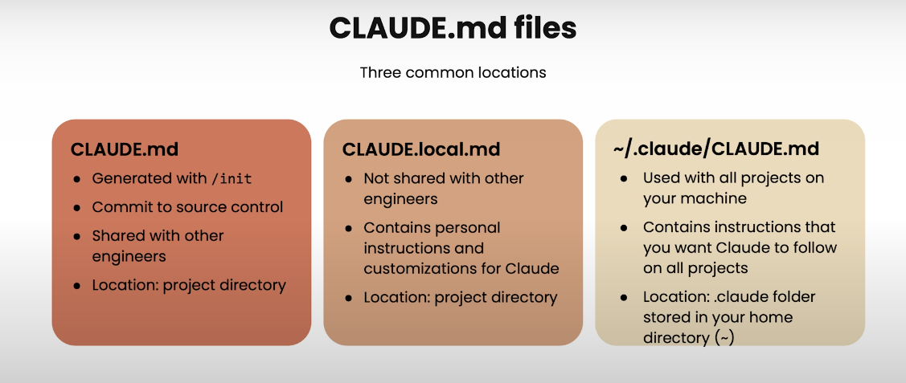
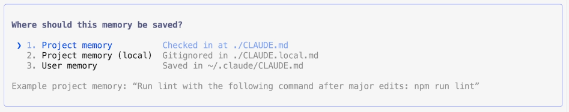

# build-with-claude
This project explain how to build projects using claude

Tutorial Link: [Claude Code](https://learn.deeplearning.ai/courses/claude-code-a-highly-agentic-coding-assistant/information)

### Install the Claude code:
Install Node.js, then run:
```
npm install -g @anthropic-ai/claude-code
```

### Instantiate the Cloude after the downloading/installing on system:

```
/init : This command will analyse and create claude.md file. this is basically all the information which is required or kind of memery for claude to run.
```
### Some notable commands:
```
/help: to see all the available commands.
/clear: to clear the context window
/compact: clear the history but keep the summary. so that we continue to work and utilizing less context window/tokens.
/ide : to set the code editor, in my case it VSCode
esc key: to interrupt claude to stop working on previous query, don't have to wait for claude to complete the request.
add and commit: can use this to add and commit the changes to the Github. it will add the nice commit message.

```

### There are 3 type of files:
1. CLAUDE.md -> This file can be checked-in into the repo and shared with other developers
2. CLAUDE.local.md -> This is your local configuration/setting which you do not want to share to other developers.
3. ~/.claude/CLAUDE.md -> This is kind of global setting which you want claude to know/follow for all the projects in your system



```
Note: We can manually update the CLAUDE.md file if we want to add any extra information. or this can be done from the claude cli command to add into the memory. using # like below:

# always use uv to run the server do not use pip directly.
```
This will prompt where to save this like below:



## Updating or adding new code to the Solution

To make sure that the right file in which we want to modify the code is in the context window we can provide that using @ + filepath, this will help claude code not to search and feigure out by itself.

Shift + tab + tab : to activate the plan mode in claude

## Adding MCP to Claude:
 - We can add MCP in our claude to extend it to use different functions and tools.
 ```
 add mcp <mcp name>
 /mcp : to check the connected mcp's
 ```

## Working with Github:
TODO: example and same commands to use it.
```
- Add and commit with description.
- Use extention for codereviews
- Create PR's and run the code reviews

```

## Running multiple Claude code session in parallel:

- Can use Github feature to create different worktree and launching different terminals and launcing claude session in each. By this we can give each session seperate task to perform.
- Once the all of the tasks are completed we can use claude from the main terminal to merge, resolve conflicts and push the changes to the github.
- At the end we can delete the work tree or kepp it for later use.

```
/resume : this commnad help you to resume your previous session from the past.
```

### Using hooks in Claude:
TODO:

### Working with Notebooks (Jupyter)


### Creating Skills:
Skill are .md file in which we can instruct repeatable tasks to do.

### 

